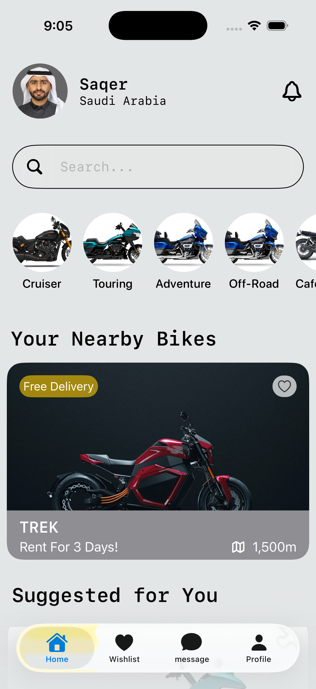

# 🎨 UI Practice Repository (SwiftUI)

This repository contains a collection of small SwiftUI projects focused on building clean, modern, and user-friendly interfaces.

---

## 🚀 Purpose

The goal of this repo is to:

* Practice designing real-world UI components
* Improve SwiftUI layout and composition skills
* Experiment with animations, spacing, and visual hierarchy
* Build reusable UI patterns

Each project is intentionally small and focused on UI/UX rather than full app logic.

---

## 📂 Structure

Each folder inside this repository — `expermintationsUI/` — represents a standalone UI project.

Example:

* `BikesProjectUI/`
* `FitnessUI/`

Each project is a separate SwiftUI app with its own structure and assets.

---

## 🖼 Preview

### 🏍 Bikes UI

  

---

## 📌 Notes

* These projects are for learning and experimentation
* No backend or heavy logic is included
* Designs may be inspired by real apps or concepts

---

## 🛠 Tech Stack

* Swift
* SwiftUI
